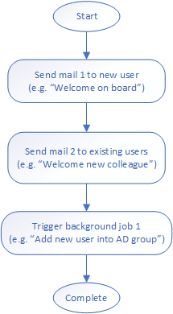

# Software framework representing a simple worfklow system in .NET Core

## Introduction

The recent trend to deliver features as part of the bigger software platform which provides common functionality, infrastructure and user experience helps to simplify an implementation of such features, which can be focused on implementation of concrete business requirements. It helps to deliver features faster and with less code. But this is also creating a high dependency on the platform code which is often shared and reused by all features. Such platform code becomes the crucial part of the software. The good platform code should be flexible enough not only to support all existing requirements, but it should be able to support a wide variety of new business requirements with fewer possible modifications. Its limitations can also become a feature blocker. Implementation of successful platforms is often a challenge also for experienced teams.

Platforms are often built by using of smaller software frameworks, which are abstractions providing a generic functionality which can be selectively changed by additional user code. In following lines, I will share a very small but powerful C# implementation of the software framework which represents a simple workflow system.

## Sample workflow
The sample demonstrates a concrete instance of workflow consisting of 3 steps, which should be automatically executed as part of the onboarding process for a new employee.
The system should send 2 different welcome mails, one to new user and another to existing users. Finally, it should trigger a background job which will add the new user into particular AD group (e.g. “All employees”).



## Abstraction
First, we need to think about when making abstraction is to find out similarities and common functionality which can be covered by generic framework code. From the sample workflow above, we can tell that the whole workflow consists of steps which are executed sequentially in the defined order. For the simplicity, we will not support execution of steps parallelly. Imagine, that step can be any custom functionality which can be executed by the framework. The framework controls the flow of the program and provides a common handling of failures and cross cutting concerns.

On the other side, there are differences in the functionality of individual steps. First two steps with sending mail functionality are very similar (they are just sending different mails). But the third step with the trigger background job functionality is completely different. It naturally categorizes steps from sample workflow into two types. Each of them has its specific parameters.

## Workflow definition
The framework requires a worfklow definition as an input. The definition is provided as JSON and uses [workflow framework model](Workflow.Framework.Model).

The sample workflow can be represented by following JSON definition:

```
{
  "Steps": [
    {
      "Type": "SendMail",
      "Param":
      {
        "MailDefinitionId": 1
      }
    },
    {
      "Type": "SendMail",
      "Param":
      {
        "MailDefinitionId": 2
      }
    },
    {
      "Type": "TriggerBackgroundJob",
      "Param":
      {
        "JobDefinitionId": 1
      }
    }
  ]
}
```

Each step in the array has “Type” and “Param” property which are common. But the “Param” property contains a step specific data, which are needed for execution of particular step type. These specific parameters use [workflow extensions model](Workflow.Extensions.Model).

## Framework code
The basic framework functionality is approx 100 lines of the [code](Workflow.Framework/Workflow.cs).

The framework ensures that all steps are instantiated via reflection, based on the step type from the JSON definition. The specific parameters are deserialised by the framework and are injected as models into step instances. Finally, all steps are sequentially processed and concrete step functionality is called.

Implementation of concrete steps functionality is part of framework [extensions](#Extensibility).

## Usage

You can run a workflow via provided [CLI](Workflow.CLI) (alternative to use it as [library](Workflow.Framework)):
```
Workflow.CLI.exe "SampleWorkflow.json"
```

Console output
```
The execution of workflow definition "SampleWorkflow.json" has started...
Step 1 of 3 <SendMail>: Started...
Step 1 of 3 <SendMail>: Simulate sending mail with MailDefinitionId "1"... Done
Step 1 of 3 <SendMail>: Completed
Step 2 of 3 <SendMail>: Started...
Step 2 of 3 <SendMail>: Simulate sending mail with MailDefinitionId "2"... Done
Step 2 of 3 <SendMail>: Completed
Step 3 of 3 <TriggerBackgroundJob>: Started...
Step 3 of 3 <TriggerBackgroundJob>: Simulate trigerring background job with JobDefinitionId "1"... Done
Step 3 of 3 <TriggerBackgroundJob>: Completed
The execution of workflow has successfully completed.
```

## The user defined workflows
This framework is able to process any workflow of supported step types just via provided JSON definition. There is no additional code change or compilation needed. Such workflow definition can be provided not only by developer but also directly by the user (there is also possibility to develop UI which can be used for creating of workflow definitions instead of using JSON file as input).

## Extensibility
Developers can also extend this framework about new step types in a very easy way.
Every step type need to provide a model for step specific parameters ([workflow extensions model](Workflow.Extensions.Model) ) and step type implementation ([workflow extensions](Workflow.Extensions)). The implementation must inherit from abstract class `StepBase<TParam>` and must be decorated by `StepAttribute` to provide a string identifier which can be used in the step "Type" property from [workflow definition](#workflow-definition).

Step specific parameters model:

```
public class SendMailParam
{
    public int MailDefinitionId { get; set; }
}
```

Step type implementation:
```
[Step("SendMail")]
public class SendMailStep : StepBase<SendMailParam>
{
    public SendMailStep(SendMailParam param) : base(param) 
    {
    }

    protected override Task ExecuteAsync(IExecutionContext context)
    {
        context.UpdateStatus($@"Simulate sending mail with MailDefinitionId ""{this.Param.MailDefinitionId}""... Done");

        return Task.CompletedTask;
    }
}
```


