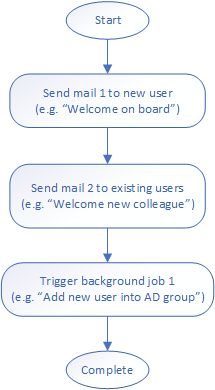

# How to create a software framework representing a simple worfklow system in .NET Core

## Introduction

The recent trend to deliver features as part of the bigger software platform becomes prevalent. Such a platform provides common functionality, shared infrastructure, and a uniform user experience intended to be reused by features. This offloads the code needed for the implementation of features, which can be focused on concrete business requirements. This approach helps to deliver features faster and with less effort. But it also creates a high dependency of features on the platform. Such the platform becomes a crucial part of the software. The platform limitations can be also blockers to the delivery of features. The good platform code should cover all existing features requirements. But moreover, it needs to be flexible enough to support a wide variety of new features requirements with fewer possible modifications. Implementation of successful platforms is often a challenge also for experienced teams.

Platforms are often built by using smaller software frameworks. The software framework is an abstraction providing a generic functionality that can be selectively changed by additional user code. In the following lines, I will share how to create a software framework representing a simple workflow system. The complete C# / .NET Core source code is included.

## Sample workflow
The sample demonstrates a concrete workflow, which should be automatically executed as part of the onboarding process for a new employee. The new employee typically gets a new user record in the corporate AD. This event can be a trigger for our workflow.

The worfklow consists of 3 steps. First, the system sends two different welcome emails, one to the new user and another to existing users. Finally, it triggers a background job, which will add the new user into a particular AD group (e.g. “All employees”).



## Abstraction
First, we need to think about when making abstraction is to find out a common functionality which can be covered by generic framework code. Consider the sample workflow above. We can tell that the whole workflow consists of some steps, which are executed sequentially. For simplicity, our framework will not support the execution of steps in parallel.

The common framework functionality is the execution of given steps in the defined order. The basic framework doesn't care about the functionality of individual steps and the step is just an abstraction. Imagine, that the step can be any custom functionality that can be executed by the framework.  The framework controls the flow of the program, provides common handling of failures, and solves cross-cutting concerns.

But from the sample workflow, we can identify differences in the functionality of individual steps. The first two steps with sending mail functionality are very similar (they are just sending different emails). But the third step, which triggers background work, is completely different.
So, we can identify two types of steps, each of them having its custom functionality.

## Workflow definition
The framework requires a definition of steps which will be executed as an input. It will be called a worfklow definition and it can be parsed from a JSON file.

The sample workflow can be represented by the following JSON worfklow definition:

```
{
  "Steps": [
    {
      "Type": "SendMail",
      "Param":
      {
        "MailDefinitionId": 1
      }
    },
    {
      "Type": "SendMail",
      "Param":
      {
        "MailDefinitionId": 2
      }
    },
    {
      "Type": "TriggerBackgroundJob",
      "Param":
      {
        "JobDefinitionId": 1
      }
    }
  ]
}
```

Each step in the array has “Type” and “Param” properties. The "Type" property contains a string that identifies the type of step. 
The “Param” property contains parameters, which are needed for the execution of a particular step. These parameters are specific to each type of step.

## Basic framework code
The basic framework functionality is approx 100 lines of the [code](Source/Workflow.Framework/Workflow.cs).

The framework ensures that all steps are instantiated via reflection, based on the step type from the JSON definition. During the instantiation, the 
specific parameters are parsed by the framework and injected into step instances.
After all the steps are instantiated, they are sequentially executed by the framework and the custom step functionality is called.

Implementation of custom steps functionality is part of framework [extensions](#Framework extensions).

## Usage

You can run a workflow via the provided [Workflow.CLI](Source/Workflow.CLI) tool (you can also use worfklow framework as a [library](Source/Workflow.Framework)):
```
Workflow.CLI.exe "SampleWorkflow.json"
```

Console output
```
The execution of workflow definition "SampleWorkflow.json" has started...
Step 1 of 3 <SendMail>: Started...
Step 1 of 3 <SendMail>: Simulate sending mail with MailDefinitionId "1"... Done
Step 1 of 3 <SendMail>: Completed
Step 2 of 3 <SendMail>: Started...
Step 2 of 3 <SendMail>: Simulate sending mail with MailDefinitionId "2"... Done
Step 2 of 3 <SendMail>: Completed
Step 3 of 3 <TriggerBackgroundJob>: Started...
Step 3 of 3 <TriggerBackgroundJob>: Simulate trigerring background job with JobDefinitionId "1"... Done
Step 3 of 3 <TriggerBackgroundJob>: Completed
The execution of workflow has successfully completed.
```

## The user-defined workflows
This framework can process any workflow provided just via a JSON definition. Such a workflow definition can be also provided directly by the user, as there is no additional code change or compilation needed. It is also possible to develop UI, which can be used for creating workflow definitions instead of using JSON file as the input. But the workflow definition can contain only supported step types. Their implementation is part of the framework [extensions](#Framework extensions).

## Framework extensions
Framework extensions contain the implementation of custom functionality for all steps types, supported by the framework.

Every step type needs to provide a model for specific parameters and the step type implementation. The implementation must inherit from abstract class `StepBase<TParam>` and must be decorated by the `StepAttribute` to provide a string identifier that can be used in the step "Type" property of the workflow definition.

Specific parameters model:

```
public class SendMailParam
{
    public int MailDefinitionId { get; set; }
}
```

Step type implementation:
```
[Step("SendMail")]
public class SendMailStep : StepBase<SendMailParam>
{
    public SendMailStep(SendMailParam param) : base(param) 
    {
    }

    protected override Task ExecuteAsync(IExecutionContext context)
    {
        context.UpdateStatus($@"Simulate sending mail with MailDefinitionId ""{this.Param.MailDefinitionId}""... Done");

        return Task.CompletedTask;
    }
}
```

Developers can extend this framework about new step types in a very easy and safe way (without touching the basic framework code).

## Summary

This was an example of creating a software framework representing a backend functionality. But the very same principles can be applied to the frontend. Imagine that you need to develop a UI page with a dashboard, containing multiple widgets. The common framework functionality is the page with a layout system for widgets. The custom functionality is the content of the widget itself.

By creating software frameworks, you can build very effective software platforms.